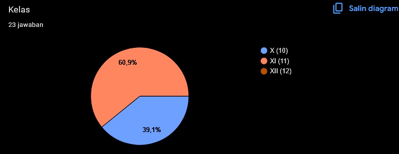
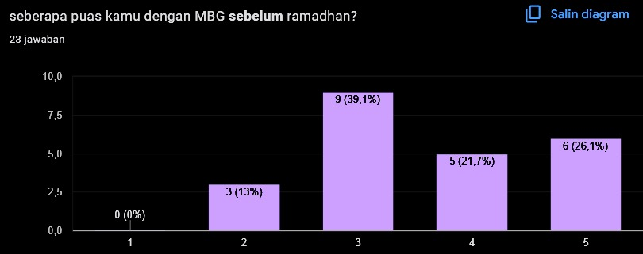
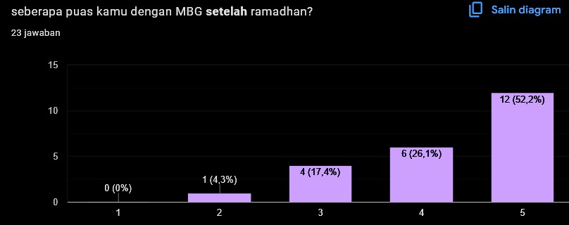
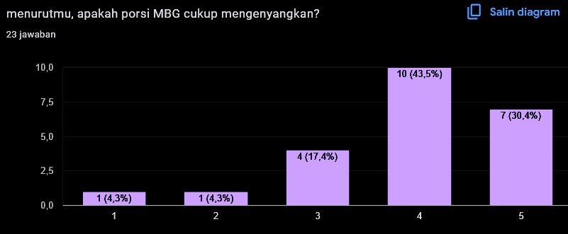
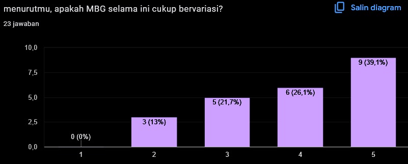
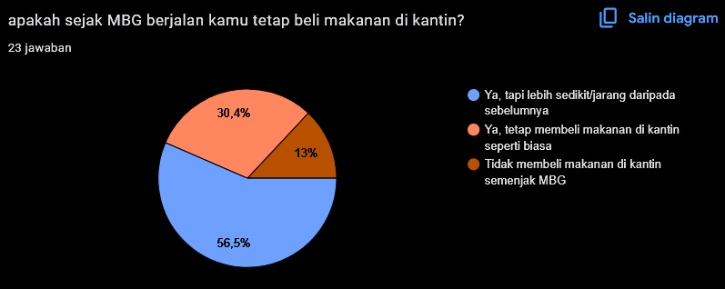
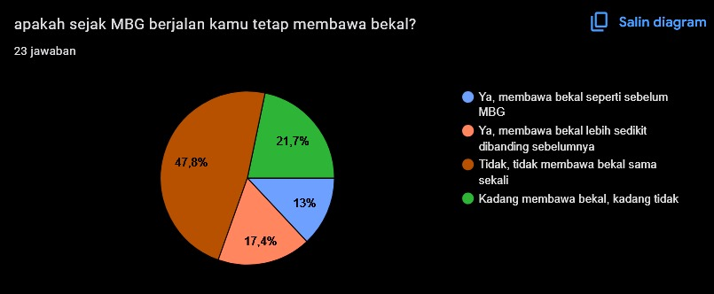
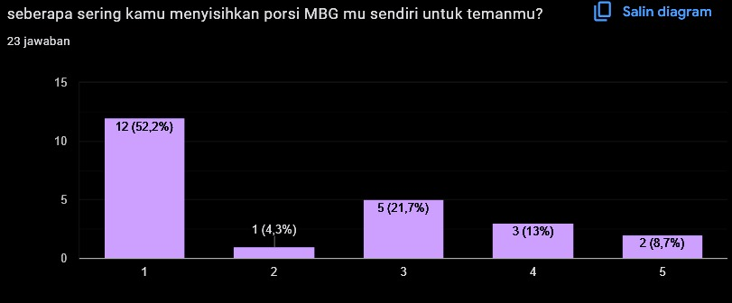
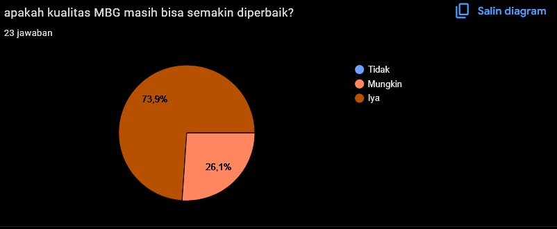

# MBG Photo Gallery

this README will be written in *mostly* english. because i find it much easier to write in. Anyways, this README contains the author's thoughts and also some fun data about MBG. before i start, do look out for inconsistencies and lazily spelled words. why is this gallery on github? well, honestly because i want to make this README.

photos are organized into months. each numbered folder represents which month it is. and this gallery contains EVERY MBG menu ever served at school. spanning from 13/01/2025 to 20/06/2025. no menu was missed throughout the semester.

the MBG on this repository is based on MAN kota Surabaya. 

### My thoughts on MBG

when i first heard of the MBG plan, i instantly disagreed. cause i thought that the money that'd be spent on MBG could be allocated somewhere else. and they definitely didnt cut the budget on of other sectors of the government in favor of MBG (though this is based on what i remember. i might be remembering things wrong). but since most of my friends and fellow students seems to be in favor of MBG, then sure. lets see what happens.

and whaddayaknow, some schools completely struggle to maintain quality in their MBG menus. some even poisoning students. im sure those problems are solved by now, but it was still quite disastrous. when MBG finally arrived to my school, it arrived 2 hours behind schedule... but the food... was alright. it was 'good enough' for me. very good for others. and somehow, throughout this entire semester, no one has been poisoned. signifying that MBG at my school are being taken care of very well.

im still under the opinion that MBG is an unecessary spending for tax money. but oh well. what power do i have at this age. this ends my thoughts on MBG.

# Some fun and perhaps interesting data from a survey at school.
at the end of the semester, a few days before libur panjang, i made a short online survey and spread it around school. in hindsight, the survey was quite rushed. and i didnt include a wide enough answer choice for certain questions. but i hope that these data help give you the general perception of MBG. though, do keep in mind the small sample (i really wish i had more!).

### 1. first of all, kelas responden. (10/11/12)

im not sure why, but kelas 11 seem to be more willing to take this survey. im not even kelas 11!

### 2. kepuasan **sebelum** ramadhan

why so specific? because i felt like ramadhan was a turning point in quality. 

NOTE: all questions with range of 1-5 answer choice is in range of 'not satisfied' to 'very satisfied'.

### 3. kepuasan ***setelah*** ramadhan

i think most of the respondents agreed with me! 

### 4. apakah cukup mengenyangkan?

### 5. apakah cukup bervariasi?

### 6. frekuensi jajan ke kantin

### 7. apakah tetap bawa bekal setelah MBG?

### 8. seberapa sering menyisihkan porsi sendiri untuk teman?

1-5 = 'tidak pernah' - 'sering'

### 9. apakah bisa di improve?

### 10. apakah memiliki saran?

this survey was NOT made by official MBG or government representatives. but from these answers, most of the respondents seem to think it is. but, useful nonetheless!

also, note that ***this question is optional***. so not everyone out of the 23 respondents actually filled this in.

1. banyak buah yang busuk dalamnya tolong jangan sampai ada lagi🙏🏻🙏🏻🙏🏻🔝

2. Tidak ada

3. Terkadang kalau buahnya salak atau sesuatu yang beraroma kuat, nasi dan lauk jadi ikut terasa seperti salak. Jadi mungkin buah yang berbau kuat bisa dibungkus buahnya menggunakan tisu atau plastik (tidak begitu rekomendasi plastik karena jadi sampah)

4. sayurnya wok, sering bgt asin/kecut. kebanyakan gw nyisihin sayurnya yang kecut gitu apalagi yang wortel ala ala hokben itu loh, aneh rasane walaupun udh tak kasih mayonaise nya

5. Sayur/buah lebih bervariasi 

6. semoga selalu bervariasi makanannya terutama pada buahnya ^^

7. mengurangi sayur yang berkuah karena jika terlalu lama bau sayur akan tidak enak atau bahkan bisa basi

8. ya , seperti membuat makanan lebih enak dan berprotein yang bergizi dan menarik minat anak anak.

9. Ya menurut ku, kyk susu itu lebih di persering

10. tidak

11. MBG ENAK, AKU SUKAK BANGETTT

12. -CIMIW-
 
13. -untuk buah nya dipilih kualitas yang terbaik,terkadang ada yang belum matang dan terkadang ada yang dalam nyaa sudah busuk

14. saya mohon untuk lebih sering memberikan susu di dalam menu MBG. Selain itu sudah cukup untuk saya

# End of README!

will this gallery be updated next school year? maybe! but this little side project consumed my focus for the past semester.
